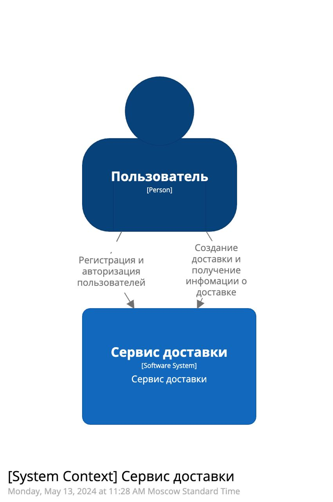
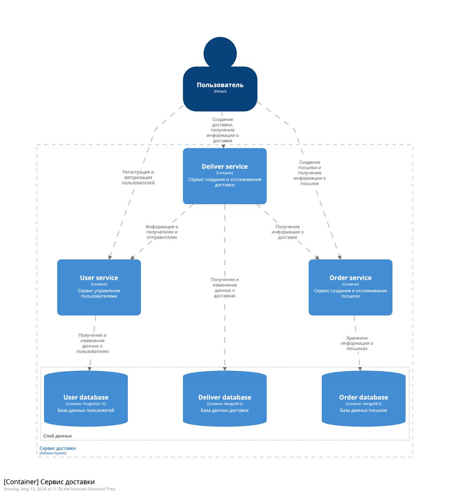
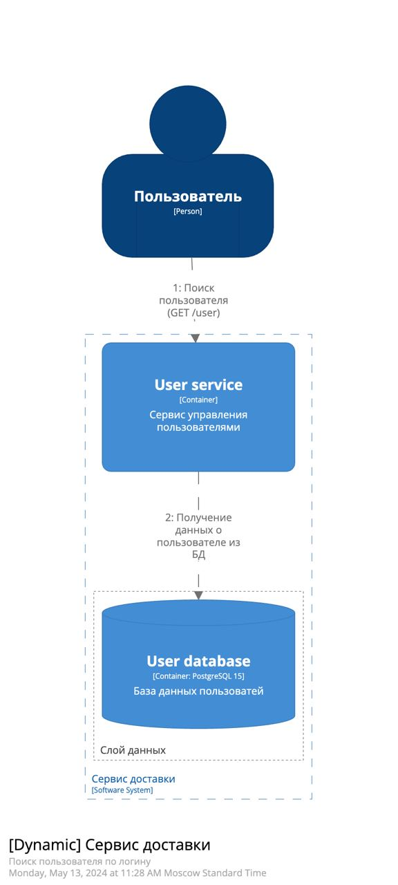
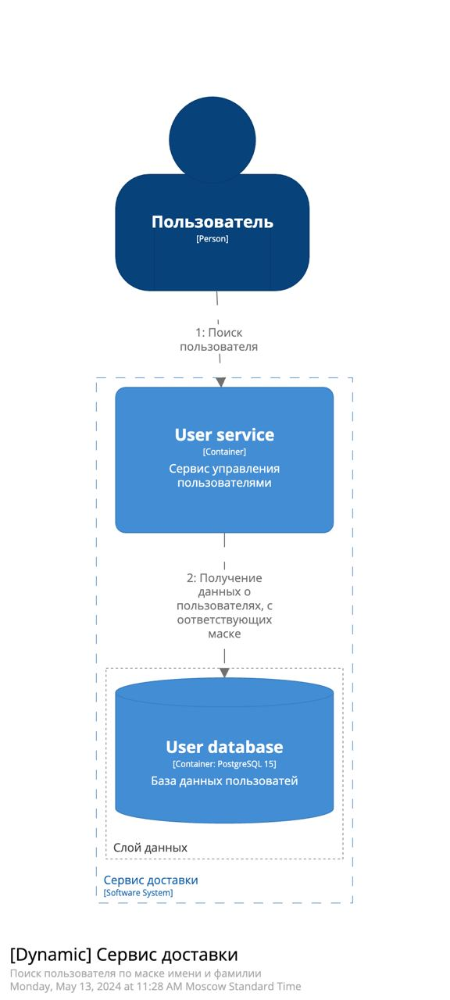
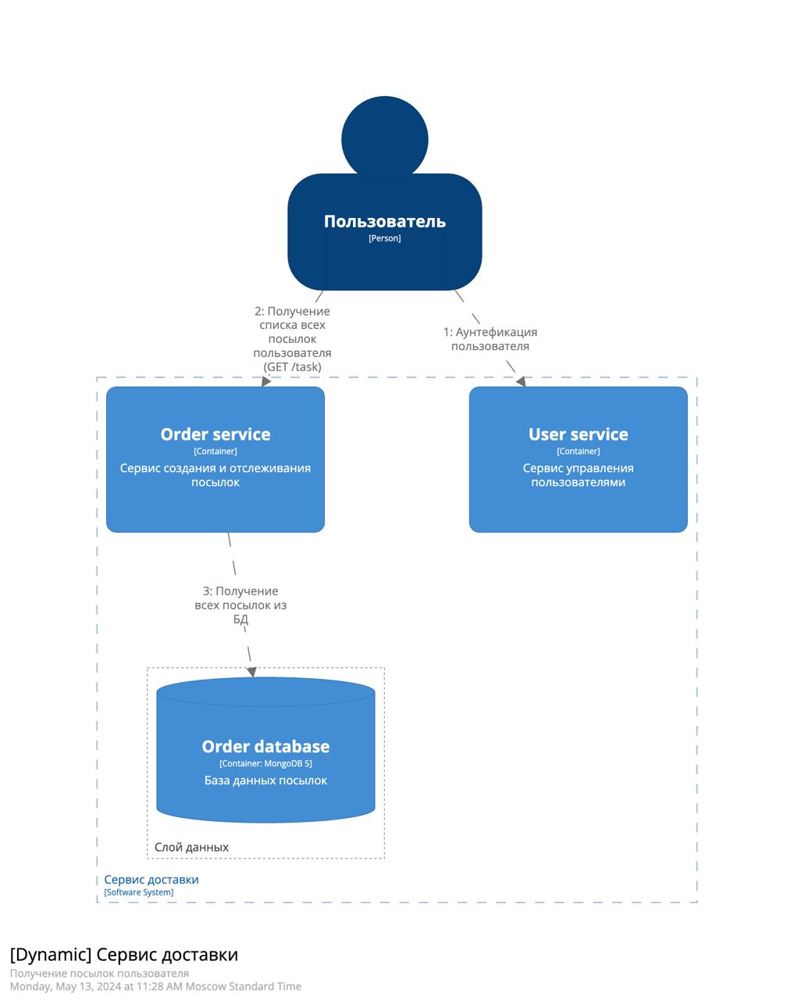
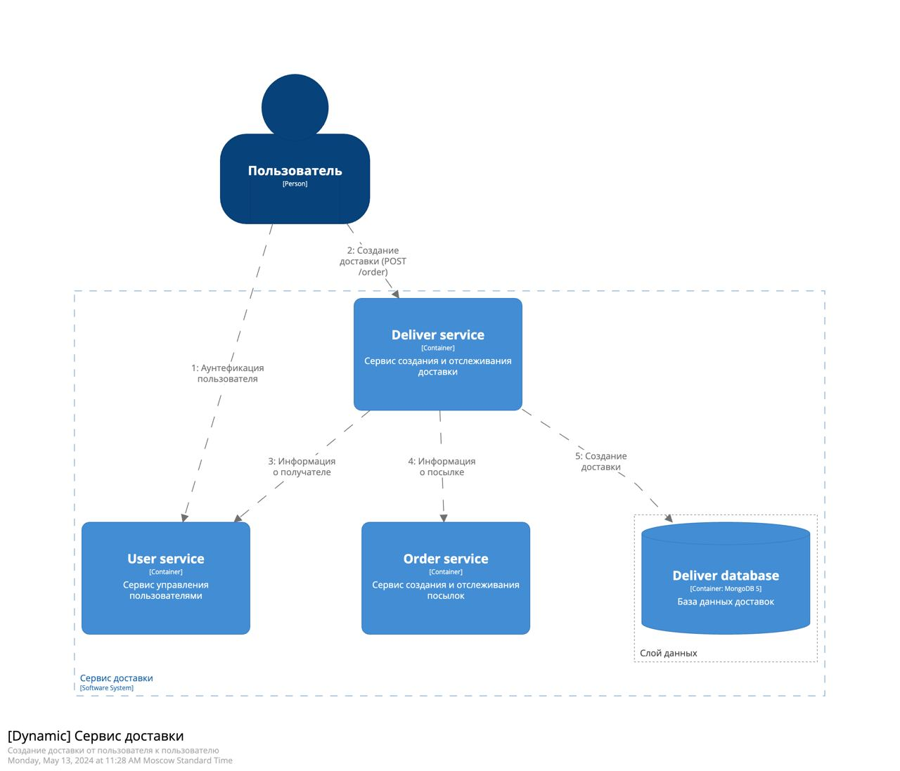
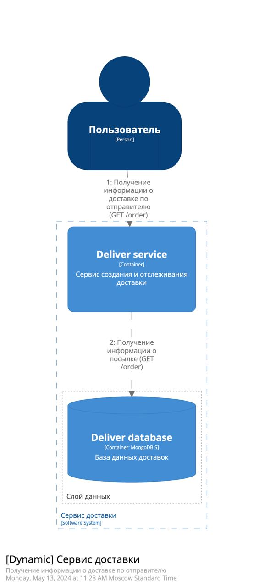

# Лабораторная работа 1
## Проектирование программной системы (Architecture As A Code)

**Вариант 6 - Сервис доставки**

1. Создать файлы с описанием «архитектуры» согласно варианту задания в Structurizr Lite
2. Требования к диаграммам:
* Должна быть контекстная диаграмма
* Должна быть диаграмма контейнеров
* Должна быть диаграмма развертывания
* Должно быть несколько динамических диаграмм

Приложение должно содержать следующие данные:
* Пользователь
* Посылка
* Доставка

Реализовать API:
* Создание нового пользователя
* Поиск пользователя по логину
* Поиск пользователя по маске имя и фамилии
* Создание посылки
* Получение посылок пользователя
* Создание доставки от пользователя к пользователю
* Получение информации о доставке по получателю
* Получение информации о доставке по отправителю

### Контекстная диаграмма

### Диаграмма контейнеров

### Динамические диаграммы
#### 1. Создание нового пользователя

#### 2. Поиск пользователя по логину

#### 3. Поиск пользователя по маске имени и фамилии

#### 4. Создание посылки

#### 5. Получение посылок пользователя

#### 6. Создание доставки от пользователя к пользователю

#### 7. Получение информации о доставке по получателю

#### 8. Получение информации о доставке по отправителю
